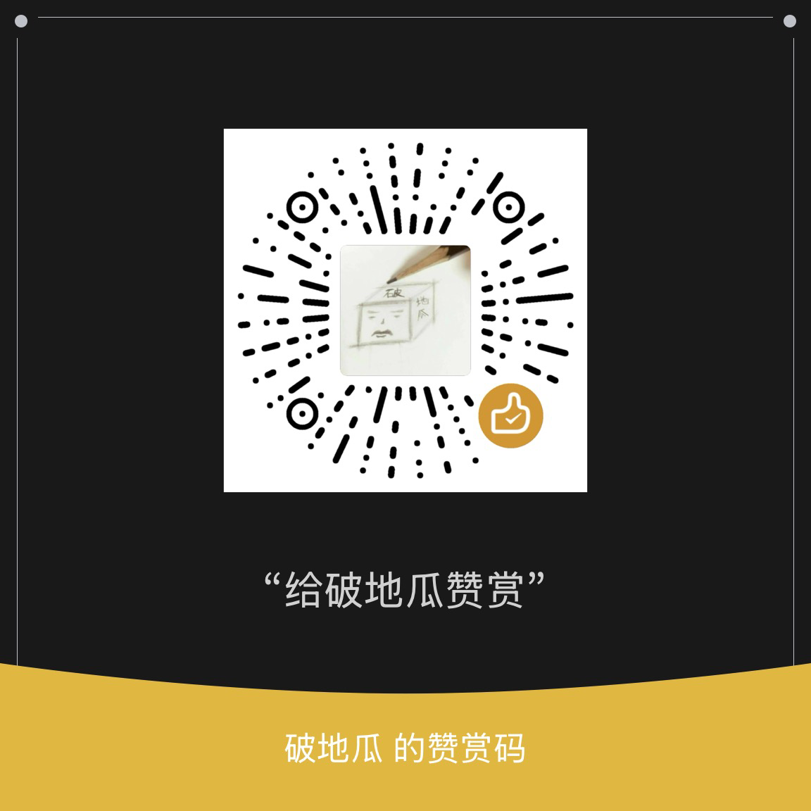

<h1 align="center" style="margin: 30px 0 30px; font-weight: bold;">kafka-visark</h1>
<h4 align="center">跨平台 kafka 客户端</h4>

	<a href='https://gitee.com/podigua/kafka-visark/stargazers'></img></a>
    <a href='https://gitee.com/podigua/kafka-visark/members'></img></a>

> 本软件使用`javafx`开发的 kafka 跨平台客户端

# 下载地址
链接: https://pan.baidu.com/s/1yBg2se16eTnodWH_cDU7Yw?pwd=y2h8 提取码: y2h8

# 功能列表
1. topic的创建,删除,查看
2. partition的新增
3. 消息的发送,消费,查询(基于 时间,offset,partition)
4. consumer的消费情况

# 贡献与支持
您可以通过下面的方法来贡献和支持该项目：

1. 在 Gitee 上为项目加注星标
2. 给予反馈
3. 提交PR
4. 贡献您的想法建议
5. 与您的朋友同事分享 kafka visark
6. 如果您喜欢 kafka visark，请考虑捐赠:

 